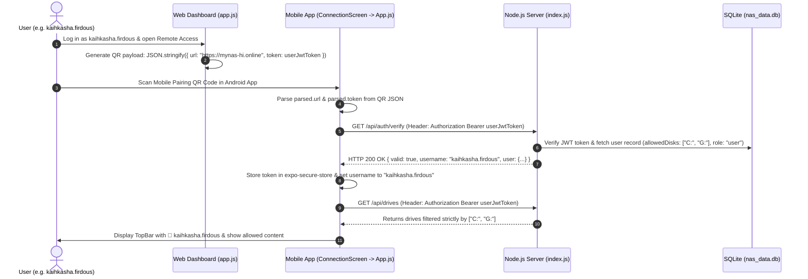
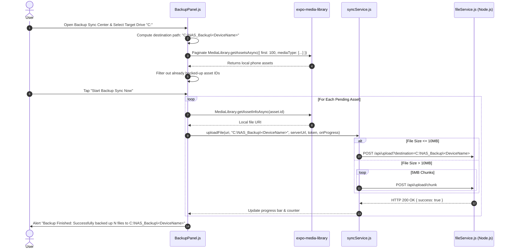

# Personal NAS — Architectural Code Graph & Technical Specification

> **Target Audience**: AI Models, Autonomous Coding Agents, and Technical Architects.  
> **Purpose**: Provides a comprehensive, structured code graph, dependency matrix, component hierarchy, data flow diagrams, and API specifications for understanding, extending, and implementing the **Personal NAS** project.

---

## 1. System Architecture Overview

```mermaid
graph TD
    subgraph Mobile Client [Expo React Native App]
        AppJS[App.js - App Root, TopBar Header & Navigation]
        ThemeCtx[ThemeContext.js]
        
        subgraph Mobile Screens
            ConnScreen[ConnectionScreen.js]
            HomeScreen[HomeScreen.js]
            LibScreen[LibraryScreen.js]
            StorScreen[StorageScreen.js]
            CtrlScreen[ControlPanelScreen.js]
            BrowserScreen[BrowserScreen.js]
        end

        subgraph Mobile Modals & Components
            AutoSyncModal[AutoSyncModal.js]
            FileExpModal[FileExplorerModal.js]
            FileViewModal[FileViewerModal.js]
            TunnelPanelComp[TunnelPanel.js]
            BackupPanelComp[BackupPanel.js]
            GaugeComp[CircularGauge.js]
        end

        subgraph Mobile Services & Plugins
            SyncService[syncService.js - AutoSync & Uploads]
            ApiFetch[apiFetch.js - HTTP Client]
            SecureStore[secureStoreService.js]
            CacheService[cacheService.js]
            OfflineQueue[offlineQueueService.js]
            BioService[biometricService.js]
            CleartextPlugin[plugins/withCleartextTraffic.js]
        end
    end

    subgraph Web Desktop Client [Vanilla JS & Liquid Glass UI]
        WebIndex[index.html]
        WebStyle[style.css]
        WebAppJS[app.js]
    end

    subgraph Backend Server [Node.js Express & SQLite]
        ServerIndex[index.js - REST Server & Routing]
        ElectronMain[main.js - Desktop Shell]
        
        subgraph Server Core Services
            DBService[dbService.js - SQLite ORM]
            FileService[fileService.js - File & Gallery I/O]
            DriveService[driveService.js - Disk Detection]
            DriveConfig[driveConfigService.js - Target Paths]
            TunnelService[tunnelService.js - Cloudflare]
            EmailService[emailService.js - SMTP Notifications]
            StreamService[streamService.js - Media Range Streaming]
            ThumbService[thumbnailService.js - Sharp Thumbnails]
            TrashService[trashService.js - Recycle Bin Manager]
            UsersService[usersService.js - User Management]
        end

        Database[(SQLite: nas_data.db)]
        FileSystem[[Host Storage / Disks C:, D:, G:, etc.]]
        Cloudflare[[Cloudflare Tunnel Binary / Network]]
    end

    %% Client-Server Connections
    ConnScreen -->|HTTP / REST| ServerIndex
    ApiFetch -->|HTTP / REST| ServerIndex
    SyncService -->|Uploads / Target Validation| ServerIndex
    WebAppJS -->|Fetch API| ServerIndex

    %% Server Internal Wiring
    ServerIndex --> DBService
    ServerIndex --> FileService
    ServerIndex --> DriveService
    ServerIndex --> DriveConfig
    ServerIndex --> TunnelService
    ServerIndex --> EmailService
    ServerIndex --> StreamService
    ServerIndex --> ThumbService
    ServerIndex --> TrashService
    ServerIndex --> UsersService

    DBService --> Database
    FileService --> FileSystem
    DriveService --> FileSystem
    TunnelService --> Cloudflare
```



---

## 2. Server Architecture & Module Dependency Matrix (`server/`)

### 2.1 File Map & Responsibilities

| Module | Responsibility | Primary Exports / Functions | Key Dependencies |
| :--- | :--- | :--- | :--- |
| [`index.js`](file:///C:/Users/irfan/.gemini/antigravity/scratch/personal-nas/server/index.js) | Main Express HTTP server, REST routes, auth middlewares, per-user disk permission filtering (`isPathAllowed`), rate limiting, static web serving. | Express App Listener, Route Handlers | `express`, `cors`, `helmet`, `express-rate-limit`, `jsonwebtoken` |
| [`dbService.js`](file:///C:/Users/irfan/.gemini/antigravity/scratch/personal-nas/server/dbService.js) | SQLite database interface for users, activity logs, sync manifests, user roles (`admin`/`user`), and disk access JSON array. | `getUserByEmail`, `createUser`, `updateUserPermissions`, `logActivity`, `isSynced`, `recordSync` | `better-sqlite3`, `bcryptjs` |
| [`fileService.js`](file:///C:/Users/irfan/.gemini/antigravity/scratch/personal-nas/server/fileService.js) | File Explorer operations, media gallery scanner, chunked upload processing, zip downloads. | `getDirectoryContents`, `getMediaGallery`, `handleChunkUpload`, `createZipArchive` | `fs`, `path`, `archiver`, `multer` |
| [`driveService.js`](file:///C:/Users/irfan/.gemini/antigravity/scratch/personal-nas/server/driveService.js) | Windows WMI / PowerShell disk space detection and drive letter caching (5s TTL). | `getStorageDrives`, `getDriveSpace` | `child_process` (PowerShell `Get-Volume`) |
| [`driveConfigService.js`](file:///C:/Users/irfan/.gemini/antigravity/scratch/personal-nas/server/driveConfigService.js) | Custom backup path validation, writability checks, target storage path resolution. | `getBackupDriveConfig`, `validateBackupTarget`, `setBackupDriveConfig` | `fs`, `path` |
| [`tunnelService.js`](file:///C:/Users/irfan/.gemini/antigravity/scratch/personal-nas/server/tunnelService.js) | Cloudflare Quick Tunnels (`*.trycloudflare.com`) and Named Tunnel process manager. | `startQuickTunnel`, `getTunnelStatus`, `stopTunnel`, `configureNamedTunnel` | `child_process` (`cloudflared`) |
| [`emailService.js`](file:///C:/Users/irfan/.gemini/antigravity/scratch/personal-nas/server/emailService.js) | SMTP client for sending verification codes and system notifications. | `sendVerificationEmail`, `sendAlertEmail` | `nodemailer` |
| [`streamService.js`](file:///C:/Users/irfan/.gemini/antigravity/scratch/personal-nas/server/streamService.js) | HTTP 206 Partial Content video and audio range streaming. | `streamMediaFile` | `fs` |
| [`thumbnailService.js`](file:///C:/Users/irfan/.gemini/antigravity/scratch/personal-nas/server/thumbnailService.js) | Image thumbnail generation and persistent disk caching. | `generateThumbnail` | `sharp` |
| [`trashService.js`](file:///C:/Users/irfan/.gemini/antigravity/scratch/personal-nas/server/trashService.js) | Soft delete / restore system with `.nas_trash` folder management. | `moveToTrash`, `restoreFromTrash`, `emptyTrash` | `fs`, `path` |
| [`usersService.js`](file:///C:/Users/irfan/.gemini/antigravity/scratch/personal-nas/server/usersService.js) | User account management, creation, permissions updates, password resets, and account unlocking. | `createUser`, `updateUserPermissions`, `resetUserPassword`, `unlockUserAccount` | `dbService` |

---

### 2.2 Server API Endpoint Index

```
REST API Routes (index.js)
├── /api/auth
│   ├── POST /login               -> Verify 6-digit passcode or username/password -> JWT Token
│   ├── POST /register            -> Register new user account with bcrypt hashing
│   ├── GET  /verify              -> Validate JWT token and return logged-in user profile & username
│   └── POST /verify-email        -> Verify email token
├── /api/drives
│   ├── GET  /                    -> List allowed storage drives (filtered by req.user.allowedDisks)
│   ├── GET  /available          -> List all host drives (admin only)
│   ├── POST /add                 -> Add storage path (admin only)
│   └── DELETE /remove            -> Remove storage path (admin only)
├── /api/files
│   ├── GET  /list                -> List files in directory path (filtered by user disk access)
│   ├── GET  /download            -> Stream single file or batch ZIP archive
│   ├── POST /delete              -> Soft-delete to trash or permanent delete (checks read-write permission)
│   ├── POST /mkdir               -> Create new subfolder (checks read-write permission)
│   └── POST /rename              -> Move/rename file or folder (checks read-write permission)
├── /api/upload
│   ├── POST /                    -> Standard multipart file upload to target path
│   └── POST /chunk               -> 5MB chunked streaming upload for large files/videos
├── /api/sync
│   ├── POST /validate-target     -> Check target drive/folder writability & free space
│   ├── GET  /manifest            -> Retrieve device sync history manifest
│   └── POST /record              -> Record synced file hash in SQLite manifest
├── /api/gallery
│   └── GET  /                    -> Paginated media items across drives (filtered by user disk access)
├── /api/stream
│   └── GET  /video               -> HTTP Range 206 video/audio streaming endpoint
├── /api/admin/users
│   ├── GET  /                    -> List registered user accounts (admin only)
│   ├── POST /                    -> Create user account (admin only)
│   ├── PUT  /:id/permissions     -> Update user role, read-only status, allowedDisks (admin only)
│   ├── POST /:id/reset-password  -> Reset user password (admin only)
│   └── POST /:id/unlock          -> Unlock locked user account (admin only)
├── /api/tunnel
│   ├── GET  /status              -> Active Cloudflare tunnel URL and status
│   ├── POST /start               -> Start Cloudflare tunnel process
│   ├── POST /stop                -> Stop Cloudflare tunnel process
│   └── POST /configure-named     -> Configure named custom domain tunnel
└── /api/system
    └── GET  /                    -> Hostname, IP addresses, system uptime, security status
```

---

## 3. Mobile App Code Graph (`mobile/`)

```mermaid
graph TD
    App[App.js] --> ThemeContext[contexts/ThemeContext.js]
    App --> TopBar[TopBar Header: Logo + User Badge]
    
    %% Navigation Screens
    App --> ConnectionScreen[components/ConnectionScreen.js]
    App --> HomeScreen[components/HomeScreen.js]
    App --> LibraryScreen[components/LibraryScreen.js]
    App --> StorageScreen[components/StorageScreen.js]
    App --> ControlPanelScreen[components/ControlPanelScreen.js]
    App --> BrowserScreen[components/BrowserScreen.js]

    %% Shared Modals
    HomeScreen --> AutoSyncModal[components/AutoSyncModal.js]
    HomeScreen --> FileExplorerModal[components/FileExplorerModal.js]
    HomeScreen --> BackupPanel[components/BackupPanel.js]
    
    LibraryScreen --> FileExplorerModal
    LibraryScreen --> FileViewerModal[components/FileViewerModal.js]
    
    StorageScreen --> CircularGauge[components/CircularGauge.js]
    ControlPanelScreen --> TunnelPanel[components/TunnelPanel.js]

    %% Mobile Service Layer & Plugins
    AutoSyncModal --> SyncService[services/syncService.js]
    LibraryScreen --> SyncService
    ConnectionScreen --> ApiFetch[services/apiFetch.js]
    ConnectionScreen --> SecureStore[services/secureStoreService.js]
    ConnectionScreen --> BioService[services/biometricService.js]
    App --> CleartextPlugin[plugins/withCleartextTraffic.js]
    
    SyncService --> CacheService[services/cacheService.js]
    SyncService --> OfflineQueue[services/offlineQueueService.js]
```



---

### 3.1 Mobile File Responsibilities

| File | Purpose | Key Exports & Hooks |
| :--- | :--- | :--- |
| [`App.js`](file:///C:/Users/irfan/.gemini/antigravity/scratch/personal-nas/mobile/App.js) | Root application component. Renders TopBar header (Logo + live user badge), manages global auth state & JWT token verification, registers background fetch task, and mounts navigation tab bar. | `App`, `AppContent` |
| [`contexts/ThemeContext.js`](file:///C:/Users/irfan/.gemini/antigravity/scratch/personal-nas/mobile/contexts/ThemeContext.js) | Provides dark/light theme tokens across all components with persistent storage. | `ThemeProvider`, `useTheme` |
| [`plugins/withCleartextTraffic.js`](file:///C:/Users/irfan/.gemini/antigravity/scratch/personal-nas/mobile/plugins/withCleartextTraffic.js) | Expo Config Plugin injecting `android:usesCleartextTraffic="true"` into `AndroidManifest.xml`. | `withCleartextTraffic` |
| [`components/ConnectionScreen.js`](file:///C:/Users/irfan/.gemini/antigravity/scratch/personal-nas/mobile/components/ConnectionScreen.js) | Server connection screen. Supports QR Code scanning with user token parsing, passcode login, user account login/register, cleartext HTTP exception handling, and HTTPS tunnel failover. | `ConnectionScreen` |
| [`components/HomeScreen.js`](file:///C:/Users/irfan/.gemini/antigravity/scratch/personal-nas/mobile/components/HomeScreen.js) | Dashboard tab. Shows multi-disk search bar, quick action cards, server storage usage gauge, and recent file list. | `HomeScreen` |
| [`components/LibraryScreen.js`](file:///C:/Users/irfan/.gemini/antigravity/scratch/personal-nas/mobile/components/LibraryScreen.js) | Gallery tab. Dual-mode viewer (`NAS Server` & `📱 Phone Gallery`), date-grouped phone media grid, album view, paginated `FlashList`, media extension filters, multiselect action bar, and targeted NAS upload modal. | `LibraryScreen` |
| [`components/StorageScreen.js`](file:///C:/Users/irfan/.gemini/antigravity/scratch/personal-nas/mobile/components/StorageScreen.js) | Drive management tab. Displays circular gauges for mounted drives filtered by user access. | `StorageScreen` |
| [`components/ControlPanelScreen.js`](file:///C:/Users/irfan/.gemini/antigravity/scratch/personal-nas/mobile/components/ControlPanelScreen.js) | System settings tab. Manages Cloudflare Tunnels, system passcode status, registered user accounts, and real-time system metrics. | `ControlPanelScreen` |
| [`components/BackupPanel.js`](file:///C:/Users/irfan/.gemini/antigravity/scratch/personal-nas/mobile/components/BackupPanel.js) | Camera roll backup panel. Resolves target drive letters (`drive.letter`), formats destination path (`<Drive>\NAS_Backup\<DeviceName>\`), paginates phone assets, and uploads media with live progress bars. | `BackupPanel` |
| [`components/AutoSyncModal.js`](file:///C:/Users/irfan/.gemini/antigravity/scratch/personal-nas/mobile/components/AutoSyncModal.js) | Auto-Sync settings dialog. Configures target drive, default folder (`NAS_Backup\<DeviceName>`), sync constraints (Wi-Fi, charging), and background sync frequency. | `AutoSyncModal` |
| [`services/syncService.js`](file:///C:/Users/irfan/.gemini/antigravity/scratch/personal-nas/mobile/services/syncService.js) | Core Auto-Sync Engine. Handles local media scanning, SHA-256 deduplication, target validation, standard upload, and 5MB chunked upload. | `runFullSync`, `uploadFile`, `uploadFileChunked`, `formatDestinationFolder` |

---

## 4. Web Dashboard Code Graph (`server/public/`)

```
server/public/
├── index.html     -> Main HTML5 single-page application structure. Contains navigation sidebar, floating topbar header, storage gauges, drive cards, file explorer table, gallery modal, admin panel, and system console.
├── style.css      -> Apple Liquid Glassmorphism design system. Multi-layer radial mesh background, light/dark mode variables, floating dock, glass cards, custom scrollbars, and responsive layouts.
└── app.js         -> Single-page JavaScript application logic. Handles authentication session tokens, WebSocket/REST metric polling, interactive file explorer CRUD operations, user-specific mobile pairing QR code generation ({ url, token }), chunked file uploads, media viewer, user permissions management, and tunnel toggles.
```

---

## 5. End-to-End Key Data Flows

### 5.1 Flow A: User-Specific Mobile Pairing & Seamless Auto-Login



---

### 5.2 Flow B: Direct Mobile Camera Roll Backup Sync



---

## 6. Database ERD & Schema (`nas_data.db`)

```mermaid
erDiagram
    users {
        INTEGER id PK
        TEXT email UNIQUE
        TEXT username
        TEXT password_hash
        TEXT role
        INTEGER is_readonly
        TEXT allowed_disks
        INTEGER is_verified
        TEXT verification_token
        TEXT created_at
    }

    activity_logs {
        INTEGER id PK
        INTEGER user_id FK
        TEXT action
        TEXT details
        TEXT ip_address
        TEXT timestamp
    }

    sync_manifest {
        INTEGER id PK
        TEXT device_id
        TEXT file_hash
        TEXT file_name
        INTEGER file_size
        TEXT nas_target_path
        TEXT synced_at
    }

    users ||--o{ activity_logs : "generates"
```

---

## 7. Implementation & Environment Setup

### 7.1 Prerequisites
- **Node.js**: v18.0.0 or higher
- **Expo CLI**: v52.0.0+ / EAS CLI v21.0.0+
- **Host OS**: Windows 10 / 11 (for native PowerShell disk space detection and NSSM service features)

### 7.2 Running the Stack Locally
```bash
# 1. Start Server Backend & Web App
cd server
npm install
node index.js
# Serves Web App at http://localhost:3000

# 2. Start Expo Mobile Development Server
cd mobile
npm install
npx expo start

# 3. Build Production Android Standalone APK via EAS
cd mobile
npx eas-cli build --platform android --profile preview

# 4. Publish Production OTA Update via EAS
cd mobile
npx eas-cli update --branch main --environment production
```
